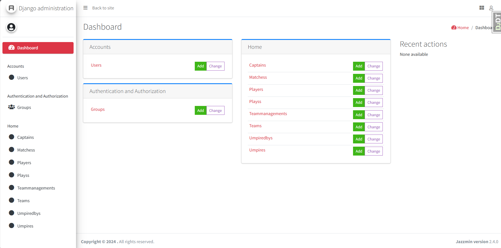
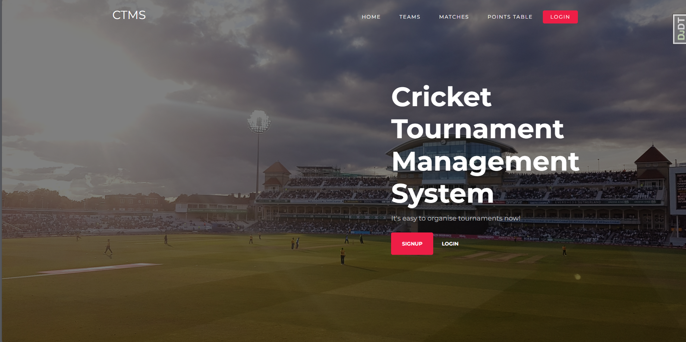
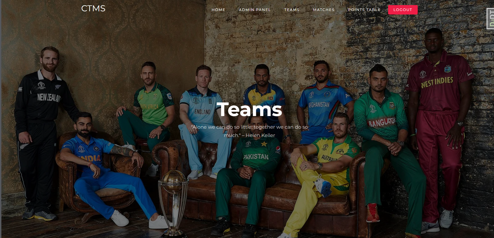

# Cricket Tournament Organizer

A simple project built using Django and MySQL to organize and manage cricket tournaments. This project leverages Docker for containerization.

## Features

- **Total Control of Tournaments**: Manage all aspects of cricket tournaments through an intuitive admin panel.
- **Team Manager Dashboard**: Provides tools for team managers to schedule, track, and store statistics for each match.
- **Match Statistics**: Schedule and track every match's statistics.
- **Player Statistics**: Monitor and manage player statistics throughout the tournament.

## Setup Instructions

### Prerequisites

1. **Docker**: Ensure Docker is installed on your machine. You can download it from [Docker's official website](https://www.docker.com/products/docker-desktop).

2. **Docker Compose**: Make sure Docker Compose is installed. It usually comes bundled with Docker Desktop.

### Local Setup

1. **Clone the Repository**

   ```bash
   git clone https://github.com/yourusername/cricket-tournament-organizer.git
   cd cricket-tournament-organizer
   ```

2. **Build and Run Docker Containers**

   ```bash
   docker-compose up --build
   ```

   This command will build the Docker images as specified in the `Dockerfile` and start the containers as defined in `docker-compose.yml`.

3. **Apply Migrations**

   Once the containers are up and running, apply the database migrations:

   ```bash
   docker-compose exec web python manage.py migrate
   ```

4. **Create a Superuser**

   Create an admin superuser to access the Django admin panel:

   ```bash
   docker-compose exec web python manage.py createsuperuser
   ```

   Follow the prompts to create the superuser account.

5. **Access the Application**

   - **Admin Panel**: Open your web browser and go to `http://localhost:8000/admin` to log in with the superuser credentials.
   - **Dashboard**: Access the main application at `http://localhost:8000`.

## Project Structure

- **`docker-compose.yml`**: Defines the services, including the web application and the MySQL database.
- **`Dockerfile`**: Contains the instructions for building the Docker image for the Django application.
- **`manage.py`**: Command-line utility for Django project management.
- **`cricket_tournament`**: The Django project directory with settings and configuration files.
- **`apps/`**: Directory containing Django applications for different features.

## Images

Here are some screenshots of the application:

1. **Admin Panel**

   

2. **Home**

   

3. **Teams**

   


## License

This project is licensed under the MIT License - see the [LICENSE](LICENSE) file for details.

## Acknowledgements

- [Django](https://www.djangoproject.com/) - The web framework used.
- [MySQL](https://www.mysql.com/) - The database used.
- [Docker](https://www.docker.com/) - For containerization.


